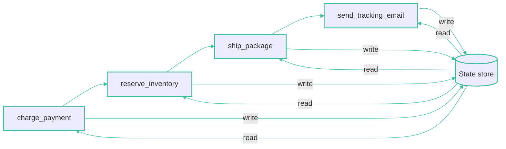

# How `process_order` stays durable

```mermaid
graph LR
  charge["charge_payment"] --> reserve["reserve_inventory"] --> ship["ship_package"] --> email["send_tracking_email"]
  charge -->|write| store[("State store")]
  store -->|read| charge
  reserve -->|write| store
  store -->|read| reserve
  ship -->|write| store
  store -->|read| ship
  email -->|write| store
  store -->|read| email
  classDef default stroke:#41bd9b,stroke-width:2px
  linkStyle default stroke:#41bd9b,stroke-width:1px
```
