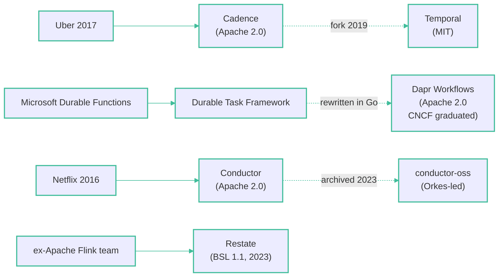

# Lineage map

```mermaid
graph LR
  Uber["Uber 2017"] --> Cadence["Cadence
  (Apache 2.0)"]
  Cadence -.fork 2019.-> Temporal["Temporal
  (MIT)"]

  MS["Microsoft Durable Functions"] --> DTFx["Durable Task Framework"]
  DTFx -."rewritten in Go".-> Dapr["Dapr Workflows
  (Apache 2.0
  CNCF graduated)"]

  Netflix["Netflix 2016"] --> Conductor["Conductor
  (Apache 2.0)"]
  Conductor -."archived 2023".-> ConductorOSS["conductor-oss
  (Orkes-led)"]

  Flink["ex-Apache Flink team"] --> Restate["Restate
  (BSL 1.1, 2023)"]
  classDef default stroke:#41bd9b,stroke-width:2px
  linkStyle default stroke:#41bd9b,stroke-width:1px
```

Two are **siblings** (Cadence ↔ Temporal). The other three are **independent lineages**.
