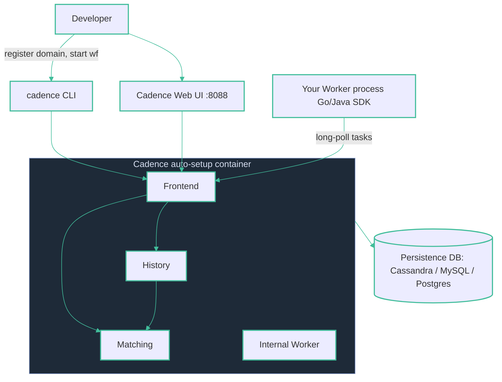

# Local dev — Cadence

```mermaid
graph TD
  dev[Developer] -->|register domain, start wf| cli[cadence CLI]
  dev --> ui[Cadence Web UI :8088]
  cli --> fe
  ui --> fe
  subgraph server[Cadence auto-setup container]
    fe[Frontend] --> hist[History]
    fe --> match[Matching]
    hist --> match
    iw[Internal Worker]
  end
  worker[Your Worker process Go/Java SDK] -->|long-poll tasks| fe
  server --> db[(Persistence DB: Cassandra / MySQL / Postgres)]
  classDef default stroke:#41bd9b,stroke-width:2px
  linkStyle default stroke:#41bd9b,stroke-width:1px
  style server fill:#1e2a38,stroke:#7c93c7,stroke-width:1px,color:#d6def0
```

**`docker-compose up`** — auto-setup server (4 roles in one container) + a persistence DB + Web UI. You run your own worker and register a domain via the CLI.
