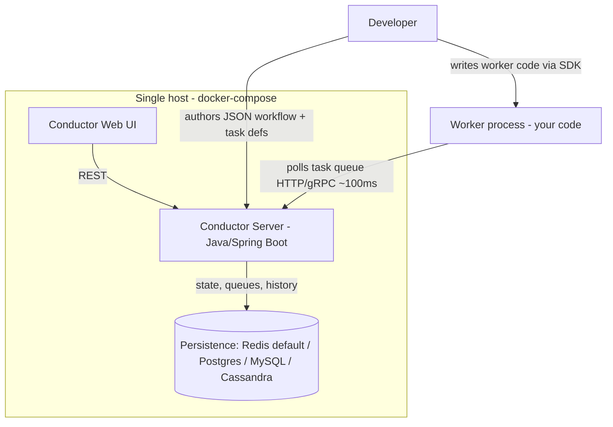

# Local dev — Conductor

```mermaid
graph TD
  Dev[Developer] -->|authors JSON workflow + task defs| Server
  Dev -->|writes worker code via SDK| Worker[Worker process - your code]
  Worker -->|polls task queue HTTP/gRPC ~100ms| Server[Conductor Server - Java/Spring Boot]
  Server -->|state, queues, history| DB[(Persistence: Redis default / Postgres / MySQL / Cassandra)]
  UI[Conductor Web UI] -->|REST| Server
  subgraph LocalDockerCompose[Single host - docker-compose]
    Server
    DB
    UI
  end
```

**`docker-compose up`** — stateless server + a persistence store + Web UI. You register workflow/task definitions as JSON, then run polling workers.
