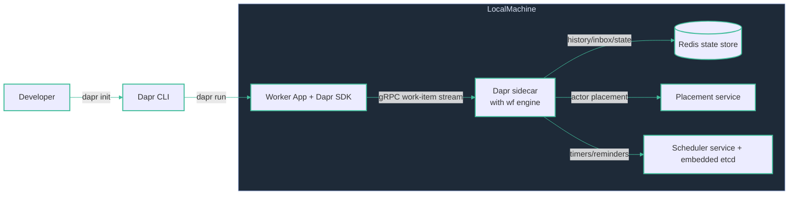

# Local dev — Dapr Workflows

```mermaid
graph LR
  Dev[Developer] -->|dapr init| CLI[Dapr CLI]
  CLI -->|dapr run| App
  subgraph LocalMachine
    App[Worker App + Dapr SDK] -->|gRPC work-item stream| Sidecar[Dapr sidecar
     with wf engine]
    Sidecar -->|history/inbox/state| Store[(Redis state store)]
    Sidecar -->|actor placement| Placement[Placement service]
    Sidecar -->|timers/reminders| Scheduler[Scheduler service + embedded etcd]
  end
  classDef default stroke:#41bd9b,stroke-width:2px
  linkStyle default stroke:#41bd9b,stroke-width:1px
  style LocalMachine fill:#1e2a38,stroke:#7c93c7,stroke-width:1px,color:#d6def0
```

**`dapr init` + `dapr run`** — no separate workflow server. The engine is embedded in the `daprd` sidecar; durability rides on a state store, Placement and Scheduler.
