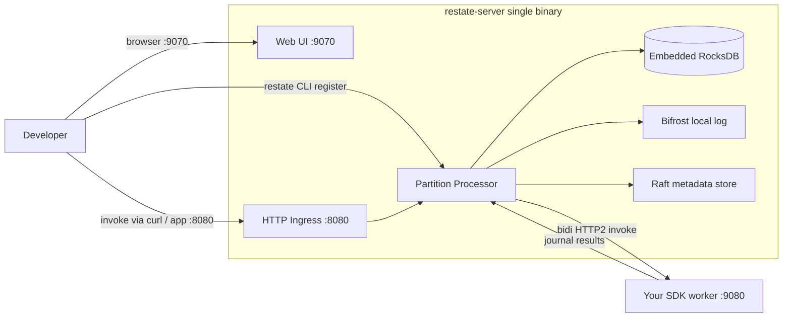

# Local dev — Restate

```mermaid
graph LR
  Dev[Developer] -->|restate CLI register| Proc
  Dev -->|browser :9070| UI
  Dev -->|invoke via curl / app :8080| Ingress
  subgraph Box[restate-server single binary]
    Ingress[HTTP Ingress :8080]
    Proc[Partition Processor]
    Rocks[(Embedded RocksDB)]
    Log[Bifrost local log]
    Meta[Raft metadata store]
    UI[Web UI :9070]
    Ingress --> Proc
    Proc --> Rocks
    Proc --> Log
    Proc --> Meta
  end
  Proc -->|bidi HTTP2 invoke| Worker[Your SDK worker :9080]
  Worker -->|journal results| Proc
```

**One `restate-server` binary** — runtime, embedded RocksDB, durable log, metadata store and Web UI in a single process. Your handlers run as a plain HTTP service.
