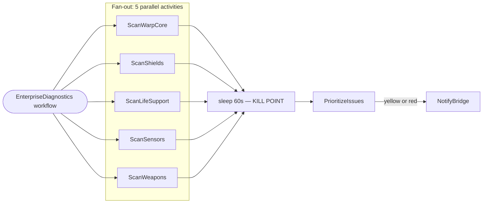

# EnterpriseDiagnostics — workflow & activities

```mermaid
flowchart LR
  WF([EnterpriseDiagnostics workflow])
  A1[ScanWarpCore]
  A2[ScanShields]
  A3[ScanLifeSupport]
  A4[ScanSensors]
  A5[ScanWeapons]
  Sleep["sleep 60s — KILL POINT"]
  A6[PrioritizeIssues]
  A7[NotifyBridge]

  subgraph Scans["Fan-out: 5 parallel activities"]
    A1
    A2
    A3
    A4
    A5
  end

  WF --> A1
  WF --> A2
  WF --> A3
  WF --> A4
  WF --> A5
  A1 --> Sleep
  A2 --> Sleep
  A3 --> Sleep
  A4 --> Sleep
  A5 --> Sleep
  Sleep --> A6
  A6 -->|"yellow or red"| A7
```

One workflow, seven activities. The workflow owns the orchestration; the activities do the work.
