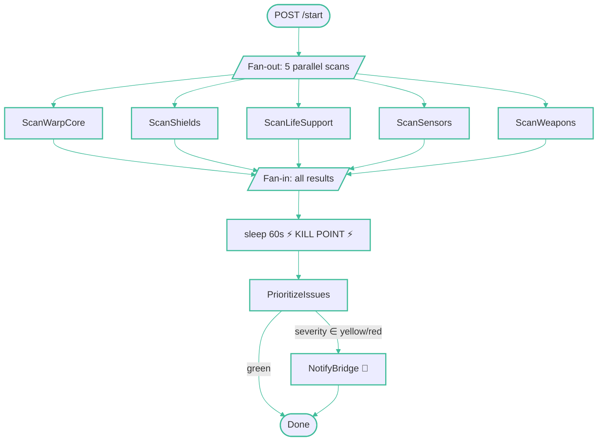

# The scenario

```mermaid
flowchart TD
  Start([POST /start])
  Start --> FanOut[/Fan-out: 5 parallel scans/]
  FanOut --> S1[ScanWarpCore]
  FanOut --> S2[ScanShields]
  FanOut --> S3[ScanLifeSupport]
  FanOut --> S4[ScanSensors]
  FanOut --> S5[ScanWeapons]
  S1 & S2 & S3 & S4 & S5 --> FanIn[/Fan-in: all results/]
  FanIn --> Sleep["sleep 60s ⚡ KILL POINT ⚡"]
  Sleep --> Prio[PrioritizeIssues]
  Prio -->|severity ∈ yellow/red| Notify[NotifyBridge 🚨]
  Prio -->|green| Done([Done])
  Notify --> Done
  classDef default stroke:#41bd9b,stroke-width:2px
  linkStyle default stroke:#41bd9b,stroke-width:1px
```
