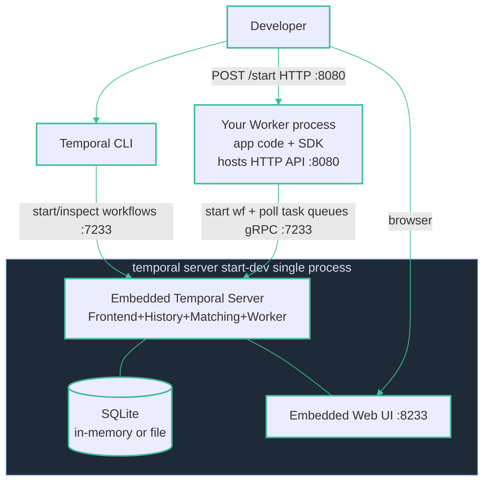

# Local dev — Temporal

```mermaid
graph TD
  Dev[Developer]
  CLI[Temporal CLI]
  subgraph DevServer[temporal server start-dev single process]
    SRV["Embedded Temporal Server<br/>Frontend+History+Matching+Worker"]
    DB[("SQLite<br/>in-memory or file")]
    UI[Embedded Web UI :8233]
    SRV --- DB
    SRV --- UI
  end
  Worker["Your Worker process<br/>app code + SDK<br/>hosts HTTP API :8080"]
  CLI -->|start/inspect workflows :7233| SRV
  Worker -->|start wf + poll task queues gRPC :7233| SRV
  Dev --> CLI
  Dev -->|POST /start HTTP :8080| Worker
  Dev -->|browser| UI
  classDef default stroke:#41bd9b,stroke-width:2px
  linkStyle default stroke:#41bd9b,stroke-width:1px
  style DevServer fill:#1e2a38,stroke:#7c93c7,stroke-width:1px,color:#d6def0
```

**`temporal server start-dev`** — one binary bundles the server, SQLite persistence and the Web UI. Zero external dependencies; you only add your worker process.
